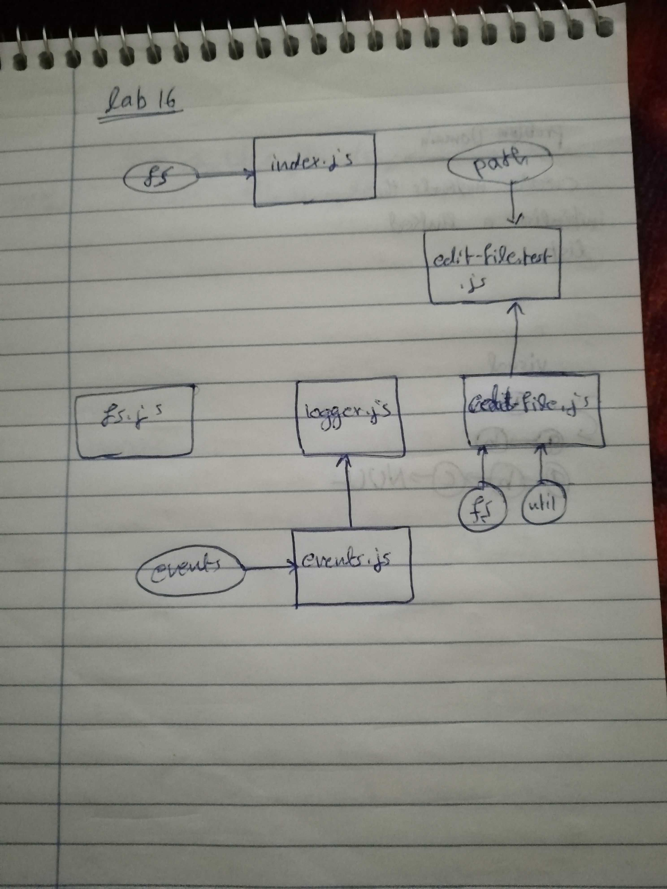

# LAB - Class 16

## Event Driven Applications 

### Author: Ahmad K. Al-Mahasneh

### Links and Resources

- [submission PR]()
- [ci/cd]() (GitHub Actions)

#### How to initialize/run your application (where applicable)

- `npm run start`

#### Tests

- How do you run tests?
  npm run test
- Any tests of note?
  jest --verbose --coverage
  - Any tests passed? 
   No

#### Worked as a group
  - Ahmad K. Al-Mahasneh
  - Qusai A. Al-Hanaktah
  - Mohammad S. Al-Hawamdeh
  - Ayman J. Al-Khawaldeh

#### UML

